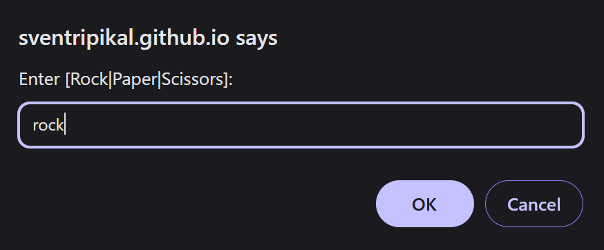
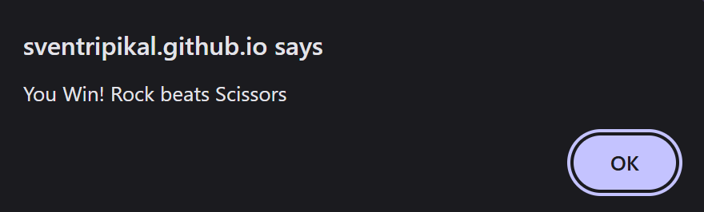
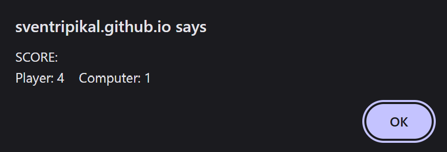
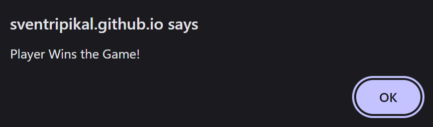

# Odin-Rock-Paper-Scissors
A quick 5-round game of Rock, Paper, Scissors that is played against a Computer on a web page and was built for _[The Odin Project](https://www.theodinproject.com/about)_

## Examples

## Inspiration
The _[Project: Rock Paper Scissors](https://www.theodinproject.com/lessons/foundations-rock-paper-scissors) (JAVASCRIPT/HTML)_ is part of _[The Odin Project: Foundations](https://www.theodinproject.com/paths/foundations/courses/foundations)_ Course
